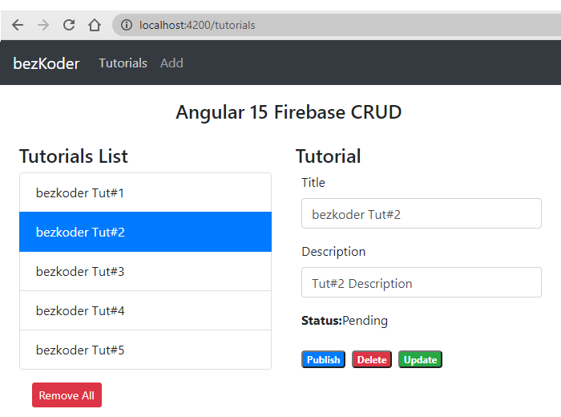

# Angular 15 Firebase CRUD example with Realtime DataBase | AngularFireDatabase

Build Angular 15 CRUD example with Firebase Realtime Database that uses `AngularFireDatabase` service.

- Each Tutorial has key, title, description, published status.
- We can make CRUD operations: create, retrieve, update, delete Tutorials.

For more detail, please visit:
> [Angular 15 Firebase CRUD with Realtime DataBase](https://www.bezkoder.com/angular-15-firebase-crud/)

> [Angular 15 Firestore CRUD example](https://www.bezkoder.com/angular-15-firestore-crud/)

> [Angular 15 Firebase Storage: File Upload/Display/Delete example](https://www.bezkoder.com/angular-15-firebase-storage/)

## More Practice
> [Angular 15 example: CRUD with Rest API](https://www.bezkoder.com/angular-15-crud-example/)

> [Angular 15 Form Validation example](https://www.bezkoder.com/angular-15-form-validation/)

> [Angular 15 JWT Authentication & Authorization with Web API](https://www.bezkoder.com/angular-15-jwt-auth/)

Fullstack with Node:
> [Angular 15 + Node Express + MySQL example](https://www.bezkoder.com/angular-15-node-js-express-mysql/)

> [Angular 15 + Node Express + PostgreSQL example](https://www.bezkoder.com/angular-15-node-js-express-postgresql/)

> [Angular 15 + Node Express + MongoDB example](https://www.bezkoder.com/angular-15-node-js-express-mongodb/)

> [Angular 15 + Node Express: File upload example](https://www.bezkoder.com/angular-15-node-express-file-upload/)

Fullstack with Spring Boot:

> [Angular 15 + Spring Boot example](https://www.bezkoder.com/spring-boot-angular-15-crud/)

> [Angular 15 + Spring Boot + MySQL example](https://www.bezkoder.com/spring-boot-angular-15-mysql/)

> [Angular 15 + Spring Boot + PostgreSQL example](https://www.bezkoder.com/spring-boot-angular-15-postgresql/)

> [Angular 15 + Spring Boot + MongoDB example](https://www.bezkoder.com/spring-boot-angular-15-mongodb/)

> [Angular 15 + Spring Boot: File upload example](https://www.bezkoder.com/angular-15-spring-boot-file-upload/)

Fullstack with Django:
> [Angular + Django example](https://www.bezkoder.com/django-angular-13-crud-rest-framework/)

> [Angular + Django + MySQL](https://www.bezkoder.com/django-angular-mysql/)

> [Angular + Django + PostgreSQL](https://www.bezkoder.com/django-angular-postgresql/)

> [Angular + Django + MongoDB](https://www.bezkoder.com/django-angular-mongodb/)